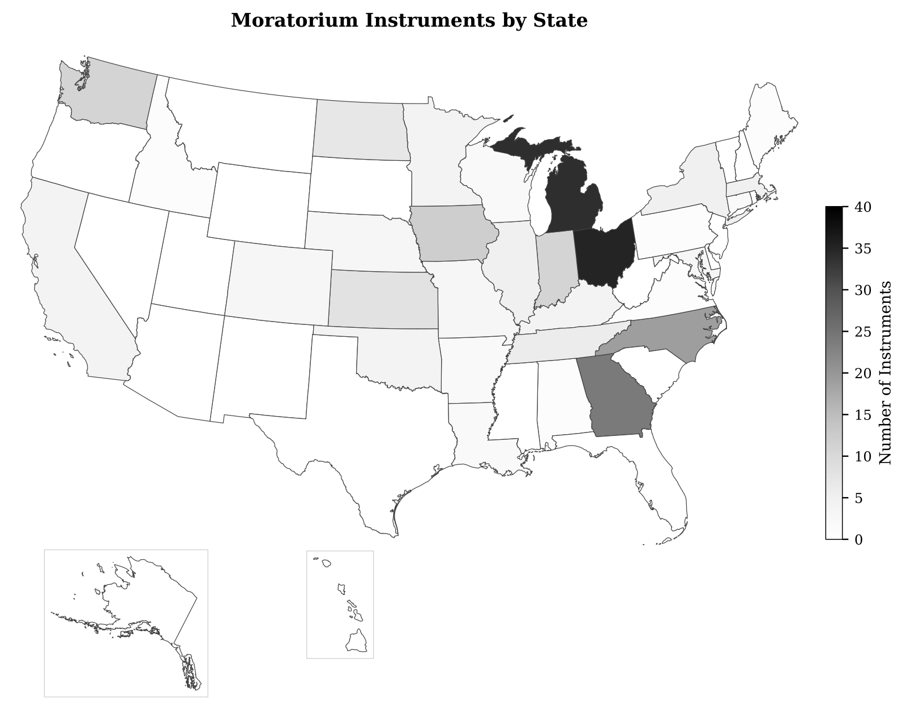

# Moratorium Data 2026

**Open data on local-government moratoria targeting data centers, battery storage, solar, wind, and cryptocurrency mining across the United States.**

This is the open companion dataset for the working paper [*Moratorium Nation: A Survey of Data Center, Renewable Energy, and Battery Storage Moratoria in the United States*](#how-to-cite).

> **As of April 2026, 222 moratorium instruments tracked across 30 states.**
> 🟢 **100 currently in force** (active or extended) · 🟡 **71 pending or proposed** (not yet adopted) · ⚪ **51 expired, replaced, or rescinded** (no longer in force)
>
> Top states by total instruments: Ohio (35), Michigan (34), Georgia (24), North Carolina (19), Iowa (12), Indiana (11), Washington (11).



---

## Quick links

|  |  |
|---|---|
| 🗺️ **Find your state** | [Browse the 30-state index →](states/README.md) |
| 📊 **Get the data** | [`data/moratorium_inventory.csv`](data/moratorium_inventory.csv) (Excel-ready) |
| 📖 **Read the FAQ** | [What is a moratorium? Why does this dataset exist? →](docs/FAQ.md) |
| 🧪 **Reproduce the analysis** | [`docs/methodology.md`](docs/methodology.md) |
| 📚 **Cite this dataset** | [How to cite ↓](#how-to-cite) |

---

## What is in this repository

This repository contains four kinds of artifacts, each in its own folder:

| Folder | What's inside | Best for |
|--------|---------------|----------|
| [`states/`](states/) | One human-readable Markdown page per state, listing every moratorium in plain English. | Anyone who wants to know what's happening in a specific state. |
| [`data/`](data/) | The underlying data — CSV files for spreadsheets, JSON for programmers. | Journalists, analysts, researchers. |
| [`figures/png/`](figures/png/) | Eight maps as PNG images (with PDF and SVG copies in sibling folders for print). | Anyone making slides, articles, or reports. |
| [`tables/`](tables/) | LaTeX-formatted tables (already pre-built, drop-in). | Academics writing papers. |

We also include the [scripts](scripts/) and [methodology](docs/methodology.md) so anyone can re-run the analysis and audit our choices.

---

## What is a moratorium?

A **moratorium** is a temporary pause that a local government — usually a city, county, or township — places on accepting or approving certain kinds of new development. While the moratorium is in effect, no one can apply for permits to build the kinds of projects it covers. The pause is meant to give the local government time to study the impacts and write permanent rules.

**Why are these moratoria happening?** Local governments have been caught flat-footed by the speed of new infrastructure proposals — particularly hyperscale data centers (often 100+ megawatts) and large battery-storage facilities. Existing zoning codes, written decades ago, don't define or regulate these uses. A moratorium buys time to catch up.

**Are these moratoria permanent bans?** No. Almost all are time-limited (typically 6 to 12 months) and have an automatic expiration date. A small number have been extended; some have been replaced by permanent regulations; a few have been rescinded.

For more, see the [FAQ](docs/FAQ.md).

---

## The headline numbers

As of **April 2026**:

- **222 moratorium instruments** tracked in our cleaned inventory
  - **100 currently in force** (92 active + 8 extended)
  - **71 pending or proposed** (public hearings scheduled, awaiting adoption)
  - **26 replaced** by permanent regulations
  - **15 expired** without a documented replacement
  - **10 rescinded** before their original expiration
- **30 states** have at least one moratorium; **20 states** have none we've identified
- **Top 10 states by instrument count**: Ohio (35), Michigan (34), Georgia (24), North Carolina (19), Iowa (12), Indiana (11), Washington (11), Kansas (8), North Dakota (7), Tennessee (6)
- **Sectors covered**: most moratoria target **data centers** (~93% mention them); a substantial share also cover **cryptocurrency mining**, with smaller numbers covering **battery storage**, **solar**, and **wind**
- **413 state-level bills** tracked in 2025–2026 (some proposing moratoria, others authorizing or restricting local moratoria)
- **348 moratorium texts** read line-by-line and coded against a 44-clause taxonomy (the confidence-≥-0.4 subset of the 526 successful structured extractions in [`data/structured_extractions.jsonl`](data/structured_extractions.jsonl))
- **220 of 222 jurisdictions geocoded** with WGS84 lat/lon (99.1% coverage); the 2 blanks are aggregate meta-rows that aren't real geographic points. Coordinates triple-checked across 89 verifications with **zero confirmed errors** ([audit details](docs/known-gaps.md#geocoding-caveats-added-v2026042))

Full state-by-state breakdown: [**states/README.md**](states/README.md).

A note on the headline number: we count **moratorium instruments** rather than "moratoria currently in force" because the public proposal of a moratorium is itself politically meaningful and often analytically important (cascade studies, comparative state policy, etc.). Use the `enacted_status` column in the inventory CSV to filter to whatever subset you need; codebook explains.

---

## How to use the data

### Open in Excel or Google Sheets

Download [`data/moratorium_inventory.csv`](data/moratorium_inventory.csv) and open it in Excel, Google Sheets, Numbers, or any spreadsheet tool. Each row is one moratorium instrument. Column definitions are in [`docs/codebook.md`](docs/codebook.md).

To filter to in-force moratoria only, filter the `enacted_status` column to `active` or `extended`.

### Load with Python (pandas)

```python
import pandas as pd
df = pd.read_csv("https://raw.githubusercontent.com/mjbommar/moratorium-data-2026/main/data/moratorium_inventory.csv")
in_force = df[df["enacted_status"].isin(["active", "extended"])]
print(in_force["state"].value_counts().head(10))
```

### Load with R

```r
df <- read.csv("https://raw.githubusercontent.com/mjbommar/moratorium-data-2026/main/data/moratorium_inventory.csv")
in_force <- df[df$enacted_status %in% c("active", "extended"), ]
sort(table(in_force$state), decreasing = TRUE)[1:10]
```

### Make a map in 30 seconds

Every row has `latitude` and `longitude` columns. Drop the CSV into [Mapbox Studio](https://www.mapbox.com/studio), [kepler.gl](https://kepler.gl/), [Datawrapper](https://www.datawrapper.de/maps/), or [QGIS](https://qgis.org/) and you have an instant point map. Or in 5 lines of Python:

```python
import pandas as pd
import folium
df = pd.read_csv("https://raw.githubusercontent.com/mjbommar/moratorium-data-2026/main/data/moratorium_inventory.csv")
m = folium.Map(location=[39.5, -98.5], zoom_start=4)
df.dropna(subset=["latitude","longitude"]).apply(
    lambda r: folium.CircleMarker([r.latitude, r.longitude], radius=4,
        popup=f"{r.jurisdiction}, {r.state} ({r.enacted_status})").add_to(m), axis=1)
m.save("map.html")  # open in browser
```

### Just want the numbers

[`data/summary_stats.json`](data/summary_stats.json) is a small JSON file with the headline totals (counts by state, breakdown by enacted-status, etc.) — useful if you want to embed live-updating numbers in your own page.

---

## How to cite

> Bommarito, Michael J. (2026). *Moratorium Nation: U.S. Infrastructure Moratorium Data* (April 2026 release) [Data set]. https://github.com/mjbommar/moratorium-data-2026

If you cite the underlying paper:

> Bommarito, Michael J. (2026). *Moratorium Nation: A Survey of Data Center, Renewable Energy, and Battery Storage Moratoria in the United States.* Working paper. Available at SSRN.

A `CITATION.cff` file is included in the repo so GitHub renders a "Cite this repository" button automatically.

---

## License

- **Data** (`data/`, `states/`, `tables/`, `figures/`) is licensed under [Creative Commons Attribution 4.0 (CC-BY-4.0)](LICENSE-data). You can reuse, redistribute, and remix the data, including commercially, as long as you credit the source.
- **Code** (`scripts/`, `notebooks/`, `examples/`) is licensed under the [MIT License](LICENSE-code).

This is a working dataset that will be refreshed periodically. Each refresh is tagged as a release; current is **v2026.04**.

---

## Status, gaps, and how to contribute

This dataset is built from public records (municipal websites, board meeting minutes, news coverage) plus AI-assisted research. We are confident in **what we have**, but we know we don't have everything — small townships often don't post agendas online, and our automated tools sometimes can't reach behind authentication walls.

- **Found a moratorium we missed?** [Open an issue](https://github.com/mjbommar/moratorium-data-2026/issues/new?template=new-moratorium.md) — we'll add it in the next release.
- **Found an error?** [Submit a correction](https://github.com/mjbommar/moratorium-data-2026/issues/new?template=correction.md).
- **Question about the data?** [Ask here](https://github.com/mjbommar/moratorium-data-2026/issues/new?template=question.md).

Known gaps and limitations are documented in [`docs/known-gaps.md`](docs/known-gaps.md).

---

## Acknowledgments

This dataset was built using AI-assisted research agents to scan municipal websites, agenda portals, board minutes, and legislative trackers across all 50 states, supplemented by manual verification of high-priority entries. The methodology is documented in detail at [`docs/methodology.md`](docs/methodology.md).

Contact: [Michael J. Bommarito](mailto:michael.bommarito@gmail.com).

---

## Repository map

```
moratorium-data-2026/
├── README.md                      # this page
├── states/                        # 50-state index + 30 per-state pages
├── data/                          # canonical CSVs and JSON
│   ├── moratorium_inventory.csv   # the 222-row main table
│   ├── state_legislation.csv      # 413-row state bill tracker
│   ├── summary_stats.json         # top-level aggregates
│   ├── structured_extractions.jsonl  # 864 lines (526 successful + 338 errors)
│   └── clause_extraction_analysis.json  # n=348 cohort summary
├── figures/                       # PNG (web), PDF (print), SVG (vector)
├── tables/                        # pre-rendered LaTeX tables
├── docs/                          # FAQ, methodology, codebook, known gaps
├── scripts/                       # generators (rebuild tables/maps from data)
├── notebooks/                     # Jupyter examples (planned)
├── examples/                      # one R / one Python example script
├── CITATION.cff                   # citation metadata
├── LICENSE-data                   # CC-BY-4.0 for data
└── LICENSE-code                   # MIT for scripts
```
